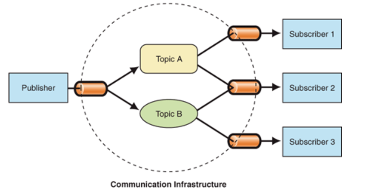

### 观察者模式

定义：定义的是对象间的一对多的依赖关系，当一个对象状态发生变化时，所有依赖于它的对象都将得到通知，并且自动更新

分析：这里定义一对多的关系，一我们称之为目标对象（Object），它有增加/删除/通知的方法，而多则称为观察者对象（Observer），它可以接收目标对象的状态改变并进行处理；目标对象可以添加一系列的观察者对象，当目标对象的状态发生变化时，就会通知所有的观察者对象

```javascript

//目标对象：添加/删除/通知
class Subject{
    constructor(){
        this.Observers = []
    }
    add(observer){
        this.Observers.push(observer)
    }
    remove(observer){
        this.Observers.forEach((item,index)=>{
            if(item===observer){
                this.Observers.splice(index,1)
            }
        })
        return this.Observers
    }
    notify(){
        this.Observers.forEach(item=>{
            item.update()
        })
    }
}

//观察对象
class Observer{
    constructor(name){
        this.name = name
    }
    update(){
        console.log(`my name is ${this.name}`)
    }
}
let sub = new Subject()
let ob1 = new Observer('observer1')
let ob2 = new Observer('observer2')
let ob = new Observer('ob')
sub.add(ob1)
sub.add(ob2)
sub.remove(ob1)
sub.remove(ob)
sub.notify()
```

我们这里定义了目标对象和观察者对象两个类，在目标对象中维护了一个观察者的数组，新增时将观察者向数组中push；然后通过notify通知所有的观察者；而观察者只有一个update函数，用来接收观察者更新后的一个回调；在有些版本的代码中会将观察者直接一定为一个函数，而非一个类，但是其本质是一样的，都是调用观察者的更新接口进行通知。
这种模式的应用在日常中常见在，给div绑定一个click监听事件，其本质就是观察者模式的一种应用

let btn = document.getElementById('btn')
btn.addEventListener('click',function(e){
    console.log(1)
})
btn.addEventListener('click',function(e){
    console.log(2)
})
这里面的btn可以看作是我们的目标对象，当它被点击时，也就是它的状态发生变化了，那么它就会通知内部添加的观察者对象，也就是addEventListener函数添加的两个匿名函数。
好处：观察者模式能够降低耦合，目标对象和观察者的逻辑互不干扰，两者都专注自身的功能，只提供和调用了更新接口；
坏处：在目标对象中维护的所有观察者都能接收到通知，无法进行过滤筛选。

### 订阅者-发布者

发布订阅模式是基于事件（主题）通道，希望接收通知的对象（Subscriber）通过自定义事件订阅主题，被激活事件的对象（Publisher）通过发布主题事件的方式通知各个订阅该主题的Subscriber对象。

分析：我们看到定义里面涉及了两种对象：接收通知的对象Subscriber和被激活事件的对象Pulisher；被激活时间对象我们可以类比观察者模式中的目标对象，来发布事件通知，而接收通知对象Subscriber可以类比为观察者对象，订阅各种通知。
发布订阅模式和观察者模式不同在于，增加了第三方事件通知；目标对象状态改变并直接通知观察者，而是通知第三方事件中心来派发通知。


类比生活中的例子，我们订阅报纸杂志不会直接去报社去订阅，而是通过一个平台，比如街边的报亭或者邮局；而报纸杂志也会有很多种，如果晨报晚报等；我们订阅报纸后出版社会通过平台给我们投递


//发布者-目标对象
class Publisher{
    constructor(name,channel){
        this.name = name
        this.channel = channel
    }
    //发布主题：注册报纸
    addTopic(topicName){
        this.channel.addTopic(topicName)
    }
    //取消发布主题
    removeTopic(topicName){
        this.channel.removeTopic(topicName)
    }
    //通知：推送报纸
    publish(topicName){
        this.channel.publish(topicName)
    }
}

//订阅者-观察者
class Subscirber{
    constructor(name,channel){
        this.name = name
        this.channel = channel
    }
    //订阅主题： 订阅报纸
    subscribe(topicName){
        this.channel.subscribeTopic(topicName,this)
    }
    //取消订阅
    unsubscribe(topicName){
        this.channel.unsubscribeTopic(topicName,this)
    }
    //更新： 接收推送
    update(topic){
        console.log(`${topic}已经送到${this.name}家了`)
    }
}

//第三方事件处理,也就是事件通道，也就是主题
class Channel{
    constructor(){
        this.topics = {}
    }
    //添加主题 ：报社在平台注册报纸
    addTopic(topicName){
        this.topics[topicName] = [] //谁订阅了谁就放这个数组里
    }
    //删除主题：报社取消注册
    removeTopic(topicName){
        delete this.topics[topicName]
    }
    //订阅者订阅主题：订阅者订阅报纸
    subscribeTopic(topicName,sub){
        if(this.topics[topicName]){
            this.topics[topicName].push(sub)
        }
    }
    //订阅者取消订阅主题：订阅者取消订报纸
    unsubscribeTopic(topicName,sub){
        this.topics[topicName].forEach((item,index)=>{
            if(item===sub){
                this.topics[topicName].splice(index,1)
            }
        })
    }

    // 通知订阅者 平台通知某个报社下所有的订阅者
    publish(topicName){
        this.topics[topicName].forEach(item=>{
            item.update(topicName)
        })
    }
}

let channel = new Channel()

//发布者主要就三个方法：添加主题addTopic，删除主题removeTopic,通知订阅者publish
//使用的时候不用关心channel里面定义的方法
let pub1 = new Publisher('报社1',channel)
let pub2 = new Publisher('报社2',channel)

pub1.addTopic('晨报1')
pub1.addTopic('晚报1')
pub2.addTopic('晨报2')

//订阅者主要有三个方法：订阅主题subscribe，取消订阅主题unsubscribe，更新操作update
let sub1 = new Subscirber('小韩',channel)
let sub2 = new Subscirber('小赵',channel)
let sub3 = new Subscirber('taylor',channel)

sub1.subscribe('晨报1')
sub2.subscribe('晨报2')
sub3.subscribe('晚报1')
sub3.unsubscribe('晚报1')

pub1.publish('晨报1')  //晨报1已经送到小韩家了
pub2.publish('晨报2')  //晨报2已经送到小赵家了
pub1.publish('晚报1')

这里面的报社理解为发布者Publisher的角色，订报纸的读者理解为订阅者Subscriber，第三方平台就是实践中心了；报社在平台上注册某一类型的报纸，然后读者就可以在平台上订阅这种报纸了；
由于平台是沟通桥梁，因此我们先定义了一个调度中心channel，然后分别定义了两家报社pub1,pub2,以及三个读者sub1,sub2,sub3;两家报社在平台上注册了晨报1，晚报1和晨报2三种类型的报纸，三个读者各自订阅喜欢的报纸，也可以进行取消。
我们可以发现在发布者中并没有直接维护一个订阅者列表，而是注册了一个事件主题，这里的报纸相当于事件主题；订阅者订阅主题，发布者推送某个主题时，订阅该主题的所有读者都会被通知到；这样避免了观察者模式无法进行筛选的缺陷。

主要区别：
观察者模式把观察者对象维护在目标对象中，需要发布消息时直接发消息给观察者。在观察者模式中，目标对象本身就知道观察者的存在的。
订阅发布模式中，发布者并不维护订阅者，也不知道订阅者的存在，所以也不会直接通知订阅者，而是通过调度中心，由调度中心通知订阅者。
